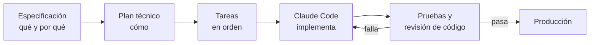

  

  
  
  

## Hola, soy Joel

Diseño producto y lo entrego en código. Llevo 7 años en esto, tres de ellos en fintech: pagos B2B en Estados Unidos y crédito con garantía hipotecaria en Perú.

Publico mis propias apps iOS en Swift y SwiftUI, y construyo productos full stack sobre PostgreSQL con desarrollo dirigido por especificación (SDD) y agentes de IA. Trabajo en remoto desde Colombia.

## Lo que estoy construyendo

<table>
  <tr>
    <td width="50%" valign="top">
      <h3>Mayapo POS</h3>
      
Sistema de punto de venta multi-restaurante. Tres aplicaciones sobre la misma base: mesero, cocina (KDS) y caja.

      <ul>
        <li>Next.js (App Router), TypeScript estricto, Tailwind, TanStack Query y Zod</li>
        <li>Supabase: PostgreSQL, Auth, Realtime y Storage</li>
        <li>Multi-tenant con Row Level Security en todas las tablas. Los permisos viven en la base, no en la interfaz</li>
        <li>Claims en el token con un Auth Hook y operaciones sensibles en funciones <code>SECURITY DEFINER</code></li>
        <li>42 migraciones y 43 bloques de pruebas SQL de aislamiento entre restaurantes y de cálculo</li>
      </ul>
      
<a href="https://mayapo-pos.vercel.app/entrar">mayapo-pos.vercel.app</a> · repositorio privado

    </td>
    <td width="50%" valign="top">
      <h3>Tiro Bacano</h3>
      
Juego arcade de baloncesto para iOS. Publicado en la App Store, con más de 98 usuarios.

      <ul>
        <li>SwiftUI y SpriteKit en Swift 6, con concurrencia estricta</li>
        <li>Compras con StoreKit 2, anuncios con AdMob, cuentas con Apple y Google</li>
        <li>Backend propio en Supabase para cuentas y ranking. Ninguna regla vive en la app: las decide PostgreSQL</li>
        <li>Edge Functions en TypeScript que verifican el dispositivo con App Attest y Play Integrity</li>
        <li>Pruebas SQL del servidor que corren con el rol y el token de un jugador real</li>
      </ul>
      
<a href="https://tirobacano.framer.ai">tirobacano.framer.ai</a> · repositorio privado

    </td>
  </tr>
  <tr>
    <td width="50%" valign="top">
      <h3>Rens</h3>
      
Finanzas personales para iOS. Publicada en la App Store, 80 usuarios activos.

      <ul>
        <li>SwiftUI con MVVM</li>
        <li>Firebase Auth con Apple y Google</li>
        <li>Firestore en tiempo real para dividir cuentas entre varias personas</li>
        <li>Swift Charts y widgets</li>
      </ul>
      
<a href="https://apps.apple.com/co/app/rens/id6757876753">App Store</a> · repositorio privado

    </td>
    <td width="50%" valign="top">
      <h3>Subtitula</h3>
      
Extensión de Chrome que subtitula y traduce en tiempo real cualquier audio del navegador. Ocho idiomas.

      <ul>
        <li>TypeScript y Manifest V3: service worker, documento offscreen y content scripts</li>
        <li>Transcripción por WebSocket con Gladia, traducción con DeepL y resúmenes con OpenAI</li>
        <li>Parte de un proyecto open source abandonado. Reparé el build y una condición de carrera en la mensajería de Chrome que perdía las traducciones</li>
      </ul>
      
repositorio privado

    </td>
  </tr>
</table>

## Cómo trabajo con IA

Uso Spec-Driven Development (SDD). La IA no recibe un prompt suelto: recibe una especificación, un plan técnico y una lista de tareas, y lo que escribe pasa por pruebas y revisión antes de entrar.

- **Especificación primero.** Cada proyecto guarda su `spec`, su plan técnico y sus tareas en el repositorio, junto al código.
- **Las reglas en la base de datos.** Seguridad y lógica de negocio en PostgreSQL, con pruebas SQL que corren sobre base limpia.
- **Prototipos antes de comprometer al equipo.** Claude, v0 y un agente propio que corre sobre Gemma 4.

## Stack

**Producto y diseño**

**Frontend**

**Backend y datos**

**iOS**

**IA**

## Experiencia

| Dónde | Rol | Qué hice |
|---|---|---|
| **Fintech de crédito con garantía hipotecaria** · Lima, remoto · 06/2024 – hoy | Product Designer · Design Expert – AI & Product Design | CRM que usan 60 asesores, con un modelo de IA integrado. El tiempo entre solicitud y desembolso bajó de 30 días a 10. Respondo por el frontend y lidero QA y dos desarrolladores. |
| **CashCloud** · Miami, remoto · 10/2023 – 08/2026 | Senior Product Designer / Design Lead | Plataforma de pagos B2B que mueve más de USD 100 millones al mes. Verificación bancaria y devoluciones ACH, cambio de método de pago, integraciones con ERP. Código en Angular. |

## Contacto

Español nativo · Inglés B2

[joelsalcedoojeda@gmail.com](mailto:joelsalcedoojeda@gmail.com) · [LinkedIn](https://www.linkedin.com/in/joel-salcedo-ojeda-a74044359) · [Portafolio](https://joelsalcedoojeda.framer.website)
