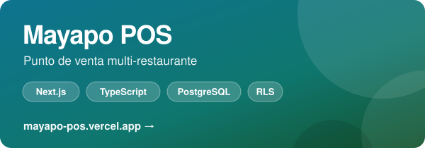
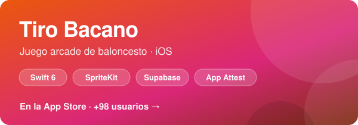
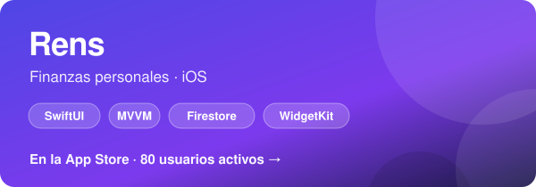
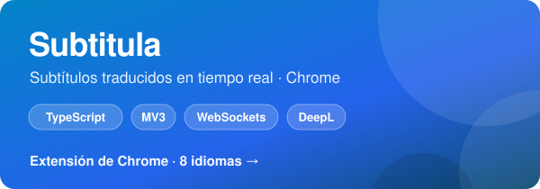
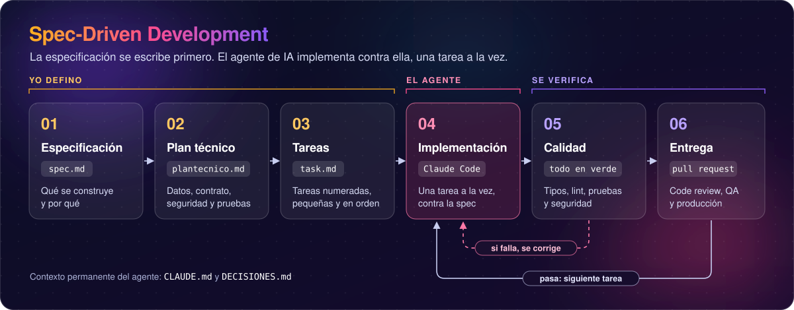
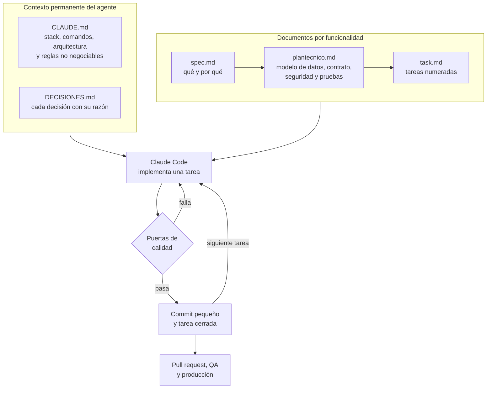

  

  
  
  
  

## 👋 Sobre mí

Soy **UX Engineer** con 7 años de experiencia, tres en fintech. Backend en C# y ASP.NET Core con Entity Framework Core sobre PostgreSQL y SQL Server, APIs GraphQL y REST, frontend en Angular y React, y aplicaciones iOS propias en Swift y SwiftUI publicadas en la App Store.

Integré al CRM de una fintech peruana de crédito un modelo de IA con el que el asesor que antes necesitaba meses de entrenamiento hoy usa el software desde su primer día.

Desarrollo con Spec-Driven Development (SDD). La especificación se escribe primero y el agente de IA implementa contra ella.

- 🏦 **3 años en fintech**: una plataforma de pagos que mueve más de USD 100 millones al mes y un CRM de crédito que usan 60 asesores
- 🔧 **Backend en producción**: APIs en ASP.NET Core, resolvers GraphQL con Hot Chocolate, webhooks de pagos ACH y conectores OAuth 2.0 con ERP
- 📱 **2 apps iOS propias** publicadas en la App Store
- 🧠 **IA en producto y en el proceso**: un modelo integrado al CRM y desarrollo dirigido por especificación con Claude Code
- 🌎 Remoto desde Colombia · Español nativo · Inglés B2

## 🚀 Lo que construyo

  
  

  
  

### 🍽️ Mayapo POS

Sistema de punto de venta multi-restaurante. Tres aplicaciones sobre una misma base de datos: mesero, cocina (KDS) y caja. **[mayapo-pos.vercel.app](https://mayapo-pos.vercel.app/entrar)**

<table>
  <tr><td width="140" valign="top"><b>Arquitectura</b></td><td>Multi-tenant desde el primer día. El token lleva restaurante, sede y rol mediante un Auth Hook, y cada política de Row Level Security lee esos claims.</td></tr>
  <tr><td width="140" valign="top"><b>Seguridad</b></td><td>RLS forzado en todas las tablas, con denegación por defecto. Las operaciones sensibles (anular una orden, cerrar caja, cambiar un precio) pasan por funciones <code>SECURITY DEFINER</code>. Auditoría de solo inserción.</td></tr>
  <tr><td width="140" valign="top"><b>Datos</b></td><td>42 migraciones versionadas. Dinero en pesos enteros con <code>numeric</code>, precios congelados al entrar a la orden y día operativo por sede.</td></tr>
  <tr><td width="140" valign="top"><b>Calidad</b></td><td>43 bloques de pruebas SQL de aislamiento entre restaurantes y de cálculo, que corren sobre una base limpia.</td></tr>
  <tr><td width="140" valign="top"><b>Stack</b></td><td><code>Next.js</code> <code>TypeScript</code> <code>PostgreSQL</code> <code>Supabase</code> <code>TanStack Query</code> <code>Zod</code> <code>Tailwind</code></td></tr>
</table>

### 🏀 Tiro Bacano

Juego arcade de baloncesto para iOS. Publicado en la App Store, con más de 98 usuarios. **[tirobacano.framer.ai](https://tirobacano.framer.ai)**

<table>
  <tr><td width="140" valign="top"><b>Cliente</b></td><td>SwiftUI con SpriteKit embebido, en Swift 6 con concurrencia estricta. Compras con StoreKit 2 y cuentas con Apple y Google.</td></tr>
  <tr><td width="140" valign="top"><b>Servidor</b></td><td>Backend propio para cuentas y ranking, pensado para iPhone y Android. Ninguna regla vive en la app: qué partida cuenta y quién gana lo decide PostgreSQL.</td></tr>
  <tr><td width="140" valign="top"><b>Integridad</b></td><td>Edge Functions en TypeScript que verifican el dispositivo con App Attest y Play Integrity antes de aceptar una partida.</td></tr>
  <tr><td width="140" valign="top"><b>Calidad</b></td><td>Pruebas SQL del servidor que se ejecutan con el rol y el token de un jugador real, más pruebas unitarias en la app.</td></tr>
  <tr><td width="140" valign="top"><b>Stack</b></td><td><code>Swift 6</code> <code>SwiftUI</code> <code>SpriteKit</code> <code>StoreKit 2</code> <code>PostgreSQL</code> <code>Edge Functions</code> <code>App Attest</code></td></tr>
</table>

### 💸 Rens

Finanzas personales para iOS. Publicada en la App Store, con 80 usuarios activos. **[Ver en la App Store](https://apps.apple.com/co/app/rens/id6757876753)**

Registro de gastos e ingresos con almacenamiento local primero, presupuestos por categoría y metas de ahorro. Las cuentas compartidas se dividen entre varias personas en tiempo real sobre Firestore.

`Swift` `SwiftUI` `MVVM` `Firebase Auth` `Firestore` `Swift Charts` `WidgetKit`

### 💬 Subtitula

Extensión de Chrome que subtitula y traduce en tiempo real cualquier audio del navegador, en ocho idiomas.

Parte de un proyecto open source abandonado que ya no compilaba. Reparé el build y resolví una condición de carrera en la mensajería de Chrome: varios listeners respondían mensajes ajenos y la traducción se perdía en el camino de vuelta.

`TypeScript` `Chrome Extensions MV3` `WebSockets` `Gladia` `DeepL` `OpenAI`

## ⚙️ Cómo trabajo

### Spec-Driven Development (SDD)

**La especificación se escribe primero y el agente de IA implementa contra ella.** El agente nunca recibe un prompt suelto. Recibe documentos versionados en el repositorio, implementa una tarea a la vez y no avanza hasta pasar las puertas de calidad.

  

**Qué resuelve**

- **Decido yo, implementa el agente.** El alcance, el modelo de datos y las reglas de seguridad quedan escritos antes de que exista una línea de código.
- **El contexto vive en el repositorio, no en un chat.** Los documentos están versionados junto al código, y cada sesión retoma desde la sección «Dónde quedamos».
- **El código generado pasa las mismas puertas que cualquier otro.** Tipos, pruebas, seguridad y revisión de código antes de llegar a producción.

**El ciclo, paso a paso**

| # | Paso | Qué pasa | Qué queda |
|---|---|---|---|
| 1 | **Especificación** | Escribo qué se construye y por qué: contexto y objetivo, alcance, funcionalidades, restricciones, riesgos asumidos y puntos abiertos | `spec.md` |
| 2 | **Plan técnico** | Bajo la especificación a decisiones: modelo de datos, contrato de funciones, cómo se cumple cada regla de seguridad y plan de pruebas | `plantecnico.md` |
| 3 | **Tareas** | Parto el plan en tareas numeradas y pequeñas, agrupadas por paso | `task.md` |
| 4 | **Implementación** | Claude Code toma una sola tarea y la implementa contra esos documentos, con las reglas de `CLAUDE.md` | Código y pruebas de esa tarea |
| 5 | **Puertas de calidad** | Compilación, tipos, lint, pruebas y seguridad. Si algo falla, la tarea vuelve al agente | Todo en verde |
| 6 | **Entrega** | Commit pequeño en una rama de Git y pull request con revisión de código. QA funcional y de regresión antes de producción | Tarea cerrada en `task.md` |

<b>Ver el flujo completo, con los documentos que lee el agente</b>

**Los artefactos**

| Artefacto | Responde | Contenido |
|---|---|---|
| `spec.md` | Qué y por qué | Contexto y objetivo, alcance, funcionalidades, restricciones transversales, riesgos asumidos y puntos abiertos |
| `plantecnico.md` | Cómo | Decisiones estructurales numeradas, modelo de datos, contrato de funciones, cómo se cumple cada regla de seguridad, plan de pruebas y supuestos confirmados |
| `task.md` | En qué orden | Tareas numeradas (`T-S3.4`) agrupadas por paso, con casilla de estado y una sección «Dónde quedamos» para retomar la siguiente sesión |
| `CLAUDE.md` | Con qué reglas | Stack, comandos, arquitectura y reglas no negociables que el agente lee antes de escribir código |
| `DECISIONES.md` | Por qué quedó así | Registro de decisiones técnicas, cada una con su razón. 34 en Mayapo POS |

**Agentes y modelos.** Claude Code para implementar sobre el repositorio y generar el código base (scaffolding). Para prototipar uso Claude, v0 y un agente propio entrenado que corre sobre Gemma 4.

**Puertas de calidad.** Una tarea no está hecha hasta que pasa la suya.

| Capa | Condición |
|---|---|
| Web | `tsc --noEmit` en modo estricto y ESLint sin errores. Los tipos de la base se regeneran desde el esquema después de cada migración |
| iOS | Debug y Release compilan, sin warnings nuevos y con las pruebas unitarias en verde |
| .NET | Pruebas unitarias en xUnit generadas desde la misma especificación, con integración continua en GitLab CI |
| Base de datos | Pruebas SQL en verde sobre una base recreada desde cero: aislamiento entre tenants, permisos por rol y cálculo |
| Seguridad | Asesor de seguridad de Supabase sin avisos WARN ni ERROR. Una prueba de catálogo verifica que el rol `authenticated` solo ejecuta las funciones de su lista |

**Control de cambios.** Cada cambio entra por una rama en Git y un pull request con revisión de código, y pasa QA funcional y de regresión antes de producción.

**Principios de arquitectura**

- **Infraestructura como código.** Nada se crea a mano en el panel: si no está en `supabase/`, no existe. Una migración aplicada no se edita, se crea otra.
- **La API son funciones.** El esquema interno no está expuesto. Las apps llaman funciones `SECURITY DEFINER` con `grant` explícito y nunca tocan tablas.
- **Denegación por defecto.** RLS habilitado y forzado en toda tabla, con políticas que leen los claims del JWT y no parámetros que mande el cliente.
- **Pruebas como el cliente real.** Se ejecutan con el rol `authenticated` y un JWT simulado, dentro de una transacción que se deshace al terminar.
- **Secretos fuera del bundle.** La llave de servicio vive solo en el servidor, detrás de `server-only`: un import equivocado rompe la compilación en vez de filtrarla.
- **Validación en cada borde.** Formularios, respuestas de API y variables de entorno pasan por Zod.

## 🧰 Stack

**Frontend**

  
  
  
  
  
  
  
  
  
  

**Backend y datos**

  
  
  
  
  
  
  
  
  
  
  
  
  
  
  
  
  
  
  

**iOS**

  
  
  
  
  
  

**IA aplicada**

  
  
  
  

**Low-code y diseño**

  
  
  
  

**Entrega y dominio**

  
  
  
  
  
  
  
  
  
  

## 💼 Experiencia

### Full Stack Developer

**Fintech de crédito con garantía hipotecaria** · Lima, Perú (remoto) · 06/2024 – Actualidad · Tiempo completo

- Integré al CRM un modelo de IA que procesa la información y ordena el trabajo del asesor (Pegasus IA). Lo que antes exigía meses de entrenamiento hoy se usa desde el primer día. Lo expuse como servicio interno detrás de una API en ASP.NET Core, con procesamiento asíncrono de los documentos del crédito.
- Desarrollé los resolvers GraphQL del CRM en C# con Hot Chocolate y Entity Framework Core sobre PostgreSQL, para los módulos de solicitud, riesgos y cobranza. Reviso el modelo de datos con el equipo de backend antes de construir, sobre queries y mutaciones.
- Respondo por el frontend del producto. El CRM lo usan hoy 60 asesores de ventas, riesgos y cobranza, y otra compañía lo compró para operarlo con su propia fuerza de asesores en México.
- Trabajé también en OutSystems, plataforma low-code sobre .NET, con UI Patterns y themes, y extensiones en C# para integrar servicios externos.
- Lidero un equipo de QA y dos desarrolladores. Reviso cada ticket antes de que entre a desarrollo. Pruebas unitarias con xUnit e integración continua en GitLab CI.
- Acompaño la integración con backend hasta producción. El tiempo entre la solicitud del crédito y el desembolso bajó de 30 días a 10.

### Frontend AI Developer

**CashCloud, fintech de pagos B2B** · Miami, Estados Unidos (remoto) · 10/2023 – 08/2026 · Contractor

- Trabajé sobre el código en Angular, con maquetación y validaciones a partir de los prototipos, en una plataforma que usan cientos de empresas en Estados Unidos y Canadá y que mueve más de USD 100 millones al mes en transacciones de pago.
- Construí el servicio de procesamiento ACH inteligente (**ACH+**). Verifica las cuentas bancarias antes de emitir el pago, monitorea cada transacción en tiempo real y automatiza devoluciones, correcciones y conciliación. Implementé en ASP.NET Core los endpoints REST de verificación de cuenta y los webhooks que reciben las devoluciones ACH.
- Construí la función que cambia el método de pago de una transacción ya emitida, de cheque a ACH o cheque digital, sin rehacerla (**PayShift**), con una máquina de estados de la transacción persistida en SQL Server.
- Construí el flujo de conexión con los sistemas contables y ERP del cliente (QuickBooks, NetSuite, Xero, SAP, Dynamics 365, Sage Intacct). Conectores con OAuth 2.0 y sincronización programada de facturas y proveedores.
- Superadministrador interno para el seguimiento de todas las transacciones, con ledger y subledger, paginación y filtros resueltos en el servidor.
- Usé Claude Code bajo SDD para generar componentes Angular y sus pruebas a partir de la especificación.
- Bajo cumplimiento SOC 2, con autenticación multifactor y roles y permisos por capas, implementados con JWT y políticas de autorización en la API.

### Frontend Developer & UX Designer

**Inlaze, iGaming y marketing de afiliados** · Bogotá, Colombia · 02/2023 – 10/2023 · Contrato por proyecto

- Llevé desde la idea hasta la primera versión en producción el CRM de afiliados, un producto que la compañía no tenía. Implementé el frontend en React sobre una API REST en Node.js.
- Con ese CRM los afiliados pasaron a gestionar y cobrar las comisiones generadas por las apuestas de los clientes que referían. El cálculo corre en el backend, sobre PostgreSQL, con un proceso programado de liquidación.
- Construí el design system del producto desde cero, publicado como librería de componentes.

### Full Stack Developer Freelance

**Montería, Colombia** · 01/2022 – 12/2022

- 10 proyectos digitales de punta a punta para clientes de ecommerce y otros sectores, con ASP.NET Core Web API, Entity Framework Core y SQL Server en el backend y React en el frontend.
- Autenticación con JWT, pasarela de pagos y panel de administración de catálogo y pedidos en los proyectos de ecommerce.

### Desarrollador Web y Diseñador UX

**Vitola SAS, retail de calzado y moda** · Colombia · 06/2019 – 12/2021

- Diseñé y desarrollé desde cero el ecommerce a medida de la marca, y llevé el catálogo completo de 17 puntos de venta físicos a un solo canal digital. Modelé catálogo, inventario y pedidos en una base relacional y expuse una API REST para sincronizar existencias de las tiendas.
- Único responsable del diseño UX/UI y del desarrollo frontend, junto a un encargado de infraestructura y servidor. El canal generó ventas desde su lanzamiento.

## 🎓 Formación

- **Licenciatura en Informática y Medios Audiovisuales** · Universidad de Córdoba · 2017 – 2022
- **The Complete Full-Stack Web Development Bootcamp** (61,5 h) · Udemy · 2025
- **UX/UI Design, UX Research, UX Writing, Product Design** · LinkedIn Learning · 2023

## 📫 Hablemos

  
  

