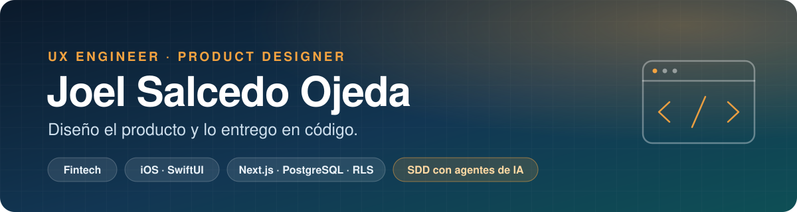
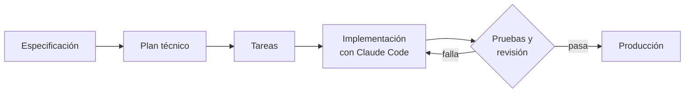

  

  <a href="https://joelsalcedoojeda.framer.website"><b>Portafolio</b></a>
  &nbsp;·&nbsp;
  <a href="https://www.linkedin.com/in/joel-salcedo-ojeda-a74044359"><b>LinkedIn</b></a>
  &nbsp;·&nbsp;
  <a href="mailto:joelsalcedoojeda@gmail.com"><b>joelsalcedoojeda@gmail.com</b></a>

---

**UX Engineer.** Diseño producto digital y lo llevo a producción en código. Tres años en fintech, en pagos B2B para Estados Unidos y en crédito con garantía hipotecaria para Perú, liderando diseño, QA y desarrollo frontend.

Por mi cuenta construyo productos completos: aplicaciones iOS en Swift y sistemas web sobre PostgreSQL, donde la seguridad y las reglas de negocio viven en la base de datos y no en la interfaz. Trabajo con Spec-Driven Development y agentes de IA.

## Trabajo seleccionado

### Mayapo POS

Sistema de punto de venta multi-restaurante. Tres aplicaciones sobre una misma base de datos: mesero, cocina (KDS) y caja. &nbsp;[mayapo-pos.vercel.app](https://mayapo-pos.vercel.app/entrar)

`Next.js` `TypeScript` `PostgreSQL` `Supabase` `Row Level Security` `TanStack Query` `Zod` `Tailwind`

<table>
  <tr><td width="140" valign="top"><b>Arquitectura</b></td><td>Multi-tenant desde el primer día. El token lleva restaurante, sede y rol mediante un Auth Hook, y cada política de Row Level Security lee esos claims.</td></tr>
  <tr><td width="140" valign="top"><b>Seguridad</b></td><td>RLS forzado en todas las tablas, con denegación por defecto. Las operaciones sensibles (anular una orden, cerrar caja, cambiar un precio) pasan por funciones <code>SECURITY DEFINER</code>. Auditoría de solo inserción.</td></tr>
  <tr><td width="140" valign="top"><b>Datos</b></td><td>42 migraciones versionadas. Dinero en pesos enteros con <code>numeric</code>, precios congelados al entrar a la orden y día operativo por sede.</td></tr>
  <tr><td width="140" valign="top"><b>Calidad</b></td><td>43 bloques de pruebas SQL de aislamiento entre restaurantes y de cálculo, que corren sobre una base limpia.</td></tr>
</table>

### Tiro Bacano

Juego arcade de baloncesto para iOS. Publicado en la App Store, con más de 98 usuarios. &nbsp;[tirobacano.framer.ai](https://tirobacano.framer.ai)

`Swift 6` `SwiftUI` `SpriteKit` `StoreKit 2` `PostgreSQL` `Supabase Edge Functions` `App Attest`

<table>
  <tr><td width="140" valign="top"><b>Cliente</b></td><td>SwiftUI con SpriteKit embebido, en Swift 6 con concurrencia estricta. Compras con StoreKit 2 y cuentas con Apple y Google.</td></tr>
  <tr><td width="140" valign="top"><b>Servidor</b></td><td>Backend propio para cuentas y ranking, pensado para iPhone y Android. Ninguna regla vive en la app: qué partida cuenta y quién gana lo decide PostgreSQL.</td></tr>
  <tr><td width="140" valign="top"><b>Integridad</b></td><td>Edge Functions en TypeScript que verifican el dispositivo con App Attest y Play Integrity antes de aceptar una partida.</td></tr>
  <tr><td width="140" valign="top"><b>Calidad</b></td><td>Pruebas SQL del servidor que se ejecutan con el rol y el token de un jugador real.</td></tr>
</table>

### Rens

Finanzas personales para iOS. Publicada en la App Store, con 80 usuarios activos. &nbsp;[App Store](https://apps.apple.com/co/app/rens/id6757876753)

`Swift` `SwiftUI` `MVVM` `Firebase Auth` `Firestore` `Swift Charts` `WidgetKit`

Registro de gastos e ingresos con almacenamiento local primero, presupuestos por categoría y metas de ahorro. Las cuentas compartidas se dividen entre varias personas en tiempo real sobre Firestore.

### Subtitula

Extensión de Chrome que subtitula y traduce en tiempo real cualquier audio del navegador, en ocho idiomas.

`TypeScript` `Chrome Extensions MV3` `WebSockets` `Gladia` `DeepL` `OpenAI`

Parte de un proyecto open source abandonado que ya no compilaba. Reparé el build y resolví una condición de carrera en la mensajería de Chrome: varios listeners respondían mensajes ajenos y la traducción se perdía en el camino de vuelta.

## Cómo trabajo

Spec-Driven Development. El agente de IA no recibe un prompt suelto: recibe una especificación, un plan técnico y una lista de tareas que viven en el repositorio junto al código. Lo que escribe pasa por pruebas y revisión antes de entrar.

## Stack

| Área | Tecnologías |
|---|---|
| **Frontend** | TypeScript · Next.js · React · Angular · Tailwind · TanStack Query |
| **Backend y datos** | PostgreSQL (RLS, funciones, triggers, migraciones) · Supabase (Auth, Realtime, Storage, Edge Functions) · Firebase · Node.js · GraphQL |
| **iOS** | Swift · SwiftUI · SpriteKit · StoreKit 2 · WidgetKit |
| **Low-code** | OutSystems, sobre la plataforma .NET (UI Patterns y themes) |
| **Diseño de producto** | Figma · Design systems · Investigación con usuarios · Pruebas de usabilidad |
| **IA aplicada** | Spec-Driven Development · Claude Code · v0 · Integración de modelos de IA en producto |

## Experiencia

| Periodo | Rol | Resultado |
|---|---|---|
| 06/2024 – hoy | **Product Designer · Design Expert, AI & Product Design** Fintech de crédito con garantía hipotecaria · Lima, remoto | Entré como UX Designer y pasé al cargo actual en 01/2026. Diseñé y entregué el CRM que usan 60 asesores de ventas, riesgos y cobranza, con un modelo de IA integrado. El tiempo entre solicitud y desembolso de un crédito bajó de 30 días a 10. Respondo por el frontend, reviso el contrato GraphQL con backend y lidero QA y dos desarrolladores. Otra compañía compró el proyecto para operarlo en México. |
| 10/2023 – 08/2026 | **Senior Product Designer / Design Lead** CashCloud · Miami, remoto | Entré como UI Designer a diseñar una versión mobile y quince meses después dirigía todo el diseño del producto. Plataforma de pagos B2B que usan cientos de empresas y mueve más de USD 100 millones al mes. Verificación bancaria y devoluciones ACH, cambio de método de pago sobre transacciones emitidas, despacho físico de cheques e integraciones con ERP. Cerca de 100 entrevistas con clientes. Código en Angular bajo cumplimiento SOC 2. |
| 02/2023 – 10/2023 | **Diseñador UI/UX** Inlaze · Bogotá | CRM de afiliados desde la idea hasta la primera versión en producción, un producto que la compañía no tenía. Con él los afiliados pasaron a gestionar y cobrar sus comisiones. Design system construido desde cero. |
| 01/2022 – 12/2022 | **Diseñador UX/UI Freelance** Montería | 10 proyectos digitales de punta a punta para clientes de ecommerce y otros sectores, con entrega documentada a desarrollo y acompañamiento durante la implementación. |
| 06/2019 – 12/2021 | **Desarrollador Web y Diseñador UX** Vitola SAS · Colombia | Ecommerce a medida diseñado y desarrollado desde cero, que llevó el catálogo de 17 puntos de venta físicos a un solo canal digital. Único responsable del diseño UX/UI y del desarrollo frontend. |

## Formación

- **Licenciatura en Informática y Medios Audiovisuales** · Universidad de Córdoba · 2017 – 2022
- **The Complete Full-Stack Web Development Bootcamp** (61,5 h) · Udemy · 2025
- **UX/UI Design, UX Research, UX Writing, Product Design** · LinkedIn Learning · 2023

---

  Remoto desde Colombia · Español nativo · Inglés B2 
  <a href="mailto:joelsalcedoojeda@gmail.com">joelsalcedoojeda@gmail.com</a>

